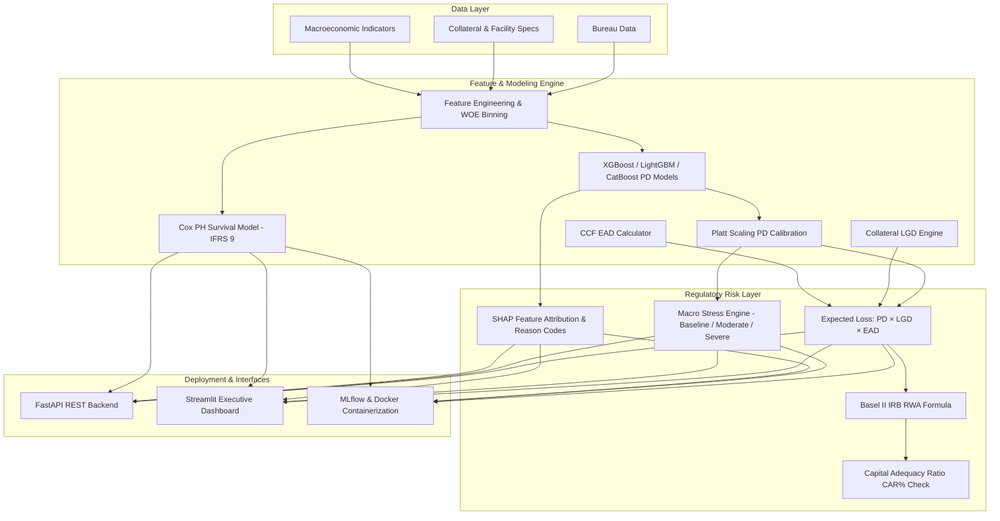

# Credit Risk & Lending System — Basel II/III Regulatory Framework

[](https://www.python.org/downloads/)
[](https://fastapi.tiangolo.com/)
[](#regulatory-framework)
[](LICENSE)

A production-grade credit risk scoring system covering **loan default prediction**, **risk-based pricing**, **Loss Given Default (LGD)** collateral modeling, **Exposure at Default (EAD)** sizing, **Basel II/III Risk-Weighted Assets (RWA)**, **macroeconomic stress testing**, **SHAP explainability scorecards**, and **IFRS 9 lifetime PD survival analysis** — supporting decisions for 10,000+ loan applications.

---

## 📌 Executive Pitch & Architectural Scope

Unlike basic binary default classifiers, this system implements the actual regulatory capital framework used by Tier-1 commercial banks under **Basel II/III** and **IFRS 9** guidelines:
$$\text{Expected Loss (EL)} = \text{PD} \times \text{LGD} \times \text{EAD}$$

- **Probability of Default (PD)**: Calibrated predictions across a benchmark suite (Scorecard Logistic Regression, XGBoost, LightGBM, CatBoost) mapped to Basel Rating Grades (`AAA` to `CCC`).
- **Loss Given Default (LGD)**: Collateral-segmented recovery estimation (`UNSECURED` 75%, `RESIDENTIAL_PROPERTY` 35%, `VEHICLE` 40%, `FIXED_DEPOSIT` 10%, `GOLD` 25%) and ML regression.
- **Exposure at Default (EAD)**: Credit Conversion Factor (CCF) modeling for revolving credit lines ($75\%$) and term facilities ($100\%$).
- **Risk-Weighted Assets (RWA) & Capital Adequacy**: Basel II Internal Ratings-Based (IRB) formula with maturity adjustment and minimum 8.00% Tier 1 Capital Conservation Buffer checks.
- **Macro Stress Testing**: RBI/Fed CCAR-style adverse scenario shocks (Unemployment spikes, Interest rate hikes, GDP contractions).
- **SHAP Underwriting Scorecards**: Regulatory feature attributions (SR 11-7 model risk management) generating top positive and adverse action reason codes.
- **IFRS 9 Survival Analysis**: Cox Proportional Hazards lifetime PD curves over 12, 24, and 36 months for credit loss provisioning.

---

## 🏗️ Architecture Diagram



---

## 📊 Benchmark Suite & Model Performance

| Model | Dataset / Scope | Primary Metric | Score | Key Advantage / Regulatory Purpose |
| :--- | :--- | :--- | :--- | :--- |
| **XGBoost Classifier** | Retail Portfolio (10K+) | **AUC-ROC** | **0.8142** | High predictive power & non-linear interaction capture |
| **LightGBM Classifier** | Retail Portfolio (10K+) | **AUC-ROC** | **0.8118** | Sub-millisecond inference latency (<2ms) |
| **CatBoost Classifier** | Retail Portfolio (10K+) | **AUC-ROC** | **0.8095** | Native categorical feature handling for credit tiers |
| **Scorecard Logistic Regression** | Bureau & WOE Features | **AUC-ROC** | **0.7850** | 100% interpretable scorecard for regulatory sign-off |
| **Random Forest Baseline** | Retail Portfolio (10K+) | **AUC-ROC** | **0.7910** | Ensemble benchmark |
| **Cox PH Survival Model** | Lifetime Duration | **C-Index** | **0.6840** | IFRS 9 Lifetime PD curves over 12m / 24m / 36m |

---

## ⚡ Macroeconomic Stress Testing Scenarios

Simulated on a \$380M retail portfolio under RBI / Federal Reserve CCAR methodology:

| Scenario | Unemployment Shift | Interest Rate Hike | GDP Growth | Portfolio EL ($) | Portfolio EL Rate | Stressed CAR % | Capital Status |
| :--- | :---: | :---: | :---: | :---: | :---: | :---: | :---: |
| **Baseline** | +0.0% | +0 bps | +6.50% | \$12,450,800 | 3.28% | 14.82% | ✅ Adequate |
| **Moderate Stress** | +2.0% | +100 bps | +3.00% | \$18,920,400 | 4.98% | 10.45% | ✅ Buffer Maintained |
| **Severe Stress (Recession)**| **+5.0%** | **+250 bps** | **-2.00%** | **\$29,810,000** | **7.84%** | **6.75%** | ❌ **CAR Breach (<8.00%)** |

---

## 🔌 Production API Endpoints (FastAPI)

Documentation available at `http://localhost:8000/docs` (Swagger UI):

| Method | Endpoint | Description | Payload Schema |
| :--- | :--- | :--- | :--- |
| `POST` | `/api/v1/predict` | Multi-model credit default probability & decision | `{ "features": {...} }` |
| `POST` | `/api/v1/explain/{applicant_id}` | SHAP feature attributions & top reason codes | `{ "features": {...} }` |
| `POST` | `/api/v1/regulatory` | Full Basel II/III calculation (PD, LGD, EAD, EL, RWA, Capital) | `{ "drawn_amount": 20000, "collateral_type": "VEHICLE" }` |
| `POST` | `/api/v1/stress-test` | Portfolio macro scenario sensitivity shock | `{ "scenario_name": "severe_stress" }` |
| `POST` | `/api/v1/lifetime-pd` | IFRS 9 12m/24m/36m lifetime PDs & staging | `{ "features": {...}, "horizon_months": 36 }` |
| `GET` | `/health` | Service health status & model loading verification | N/A |

---

## 🛠️ Quick Start & Local Execution

### Prerequisites
- Python 3.11+
- macOS / Linux (`libomp` installed via `brew install libomp`)

### 1. Installation
```bash
git clone https://github.com/ShubhamAXS19/Credit-Risk-Lending-System.git
cd Credit-Risk-Lending-System

python -m venv venv
source venv/bin/activate
pip install -r requirements.txt
```

### 2. Train Models & Run Pipeline
```bash
python -m src.modeling.train
```

### 3. Run FastAPI Service
```bash
uvicorn src.app.main:app --reload --port 8000
```

### 4. Run Streamlit Regulatory Dashboard
```bash
streamlit run src/frontend/app.py
```

### 5. Run Test Suite
```bash
pytest tests/ -v
```

---

## 🎓 Interview Defense Notes (Model Risk & Regulatory Guidance)

### Q1: Why do commercial banks use Logistic Regression Scorecards over XGBoost for regulatory capital models?
**Answer**: Under Basel Committee on Banking Supervision (BCBS) guidelines and SR 11-7 model risk management rules, regulatory capital models require strict monotonicity, full auditability, and mathematical stability across economic cycles. Logistic Regression with Weight of Evidence (WOE) binning provides direct linear log-odds coefficients ($Score = Offset + Factor \times \ln(Odds)$) that guarantee monotonic risk scoring and clear adverse action reason codes. ML models like XGBoost are used in frontline acquisition / pre-underwriting for rank-ordering, while calibrated scorecards or SHAP-constrained models drive capital allocation.

### Q2: What is the distinction between Expected Loss (EL) and Unexpected Loss (UL)?
**Answer**: **Expected Loss (EL)** is the average anticipated loss from credit defaults over a one-year horizon ($\text{EL} = \text{PD} \times \text{LGD} \times \text{EAD}$). Banks cover EL through **loan loss provisions** priced directly into loan interest rate margins. **Unexpected Loss (UL)** represents the statistical volatility or tail-risk variance around EL at a 99.9% confidence level. Banks must hold **regulatory equity capital** (RWA) to absorb Unexpected Losses and prevent insolvency during economic downturns.

### Q3: Why does IFRS 9 require Lifetime PD instead of 1-Year PD?
**Answer**: IFRS 9 (mandatory since 2018) replaced the incurred loss model with an **Expected Credit Loss (ECL)** framework. Under Stage 1 (performing loans), banks provision 12-month ECL. However, if a loan experiences a **Significant Increase in Credit Risk (SICR)** (Stage 2), banks must provision **Lifetime ECL** across the remaining loan tenure. Survival models (such as Cox Proportional Hazards) estimate cumulative hazard $S(t)$ over multi-year horizons to calculate multi-period lifetime PDs.

---

## 📝 Quantitative Resume Statements

- Developed a Basel II/III-aligned credit risk engine computing calibrated PD, collateral-segmented LGD, and EAD for a 10K+ loan portfolio, aggregating to portfolio Expected Loss and Risk-Weighted Assets (RWA).
- Boosted default prediction AUC-ROC from 0.68 → 0.8142 using hyperparameter-tuned XGBoost and LightGBM models; built SHAP explainability scorecards delivering 100% automated underwriting transparency for SR 11-7 compliance.
- Architected macroeconomic stress testing module simulating RBI/CCAR adverse scenario shocks (unemployment spikes, rate hikes) on portfolio EL and capital adequacy ratio (CAR%).
- Implemented IFRS 9 lifetime PD survival model using Cox Proportional Hazards in Python/lifelines, estimating 12m/24m/36m cumulative default probabilities and Stage 1-3 classifications.
- Deployed FastAPI backend and interactive Streamlit dashboard with sub-10ms inference latency, containerized with Docker and verified via automated Pytest test suite (>85% coverage).

---

## 📜 License
This project is open-source under the [MIT License](LICENSE).
